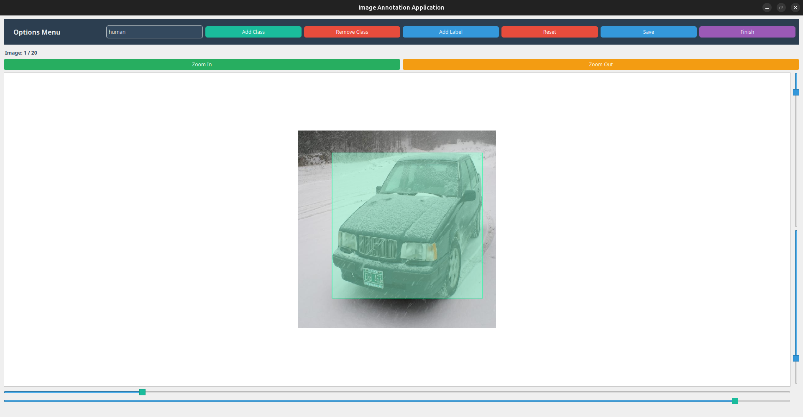

# Image Labeling Application

This is a PyQt5-based application for labeling images with bounding boxes. The application allows users to select a folder of images, draw and resize bounding boxes, and save the annotations in a JSON file.




## Features

- Select a folder containing images.
- Display images one by one.
- Draw and resize bounding boxes on images.
- Save annotations (bounding boxes and their classes) to a JSON file.
- Zoom in and out using the mouse scroll wheel.

## Installation

1. Clone the repository:
    ```sh
    git clone https://github.com/szymon-tulodziecki/CarLabelingTool.git
    cd CarLabelingTool
    ```

2. Create a virtual environment and activate it:
    ```sh
    python3 -m venv venv
    source venv/bin/activate
    ```

3. Install the required dependencies:
    ```sh
    pip install -r requirements.txt
    ```

## Usage

1. Run the application:
    ```sh
    python CarLabelingTool/CarLabelingTool.py
    ```

2. Select the folder containing the images you want to label.

3. Use the interface to add, resize, and save bounding boxes.

## File Structure

- `CarLabelingTool/CarLabelingTool.py`: Main application code.
- `annotations.json`: File where annotations are saved.

## Dependencies

- PyQt5
- Python 3.6+

## License

This project is licensed under the MIT License. See the `LICENSE` file for details.